### Uygulama Tanıtımı

Bu mobil uygulama, kullanıcılara "Rick and Morty" evrenindeki bölümleri ve karakterleri keşfetme olanağı sunar. Kullanıcılar, bölüm detaylarına, karakter bilgilerine erişebilir ve favori karakterlerini kaydedebilirler.

### Kullanılan Teknolojiler

- **React Native:** Uygulama, iOS ve Android platformlarında çalışacak şekilde React Native kullanılarak geliştirilmiştir.
- **Redux Toolkit:** Uygulama durum yönetimi için Redux Toolkit kullanılmıştır.
- **React Navigation:** Sayfa geçişleri ve navigasyon için React Navigation kütüphanesi tercih edilmiştir.
- **Axios:** API istekleri için Axios HTTP istemcisi kullanılmıştır.
- **AsyncStorage:** Kalıcı veri saklama işlemleri için React Native AsyncStorage kullanılmıştır.

### Uygulama Yapısı

Uygulama, aşağıdaki ana ekranlardan oluşmaktadır:

- **HomeScreen:** Uygulamanın ana sayfasıdır. Kullanıcı bu ekrandan diğer ekranlara geçiş yapabilir.
- **EpisodesScreen:** "Rick and Morty" bölümlerinin listelendiği ekrandır. Kullanıcılar bölüm adlarına tıklayarak detay sayfalarına gidebilirler.
- **EpisodeDetailsScreen:** Seçilen bölümün detaylarının gösterildiği sayfadır. Bölüm hakkında genel bilgiler ve bölümde yer alan karakterler listelenir.
- **CharacterDetailsScreen:** Seçilen karakterin detaylarının gösterildiği ekrandır. Karakter hakkında ayrıntılı bilgi verilir.
- **FavoriteCharacters:** Kullanıcının favori karakterlerinin listelendiği ekrandır. Kullanıcılar buradan karakterleri favorilerden çıkarabilirler.

### Özellikler

- **Arama Fonksiyonu:** Kullanıcılar, bölümler ve karakterler üzerinde arama yapabilirler. Arama, API üzerinden gerçekleştirilir ve sonuçlar dinamik olarak listelenir.
- **Favori Karakterler:** Kullanıcılar, beğendikleri karakterleri favorilere ekleyebilir ve bu listeyi yönetebilirler. Favori listesi maksimum 10 karakter ile sınırlıdır.

### Kurulum ve Çalıştırma

Uygulamayı geliştirme ortamınızda kurulum ve çalıştırma adımları için:

```bash
git clone https://github.com/oguzhanabalta/konusarakogren-case
cd AwesomeProject
npm install
npx react-native run-android # Android için
npx react-native run-ios # iOS için
```

### Uygulama Ekran Görüntüleri

---
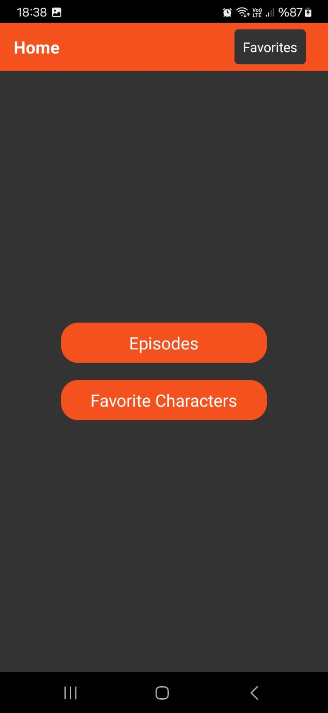
#### Genel Bakış
Ana Sayfa ekranı, kullanıcıların uygulamanın temel özelliklerine erişebildiği bir başlangıç noktası olarak tasarlanmıştır. Bu ekran, uygulamanın farklı bölümlerine hızlı ve kolay erişim sağlamak için tasarlanmış düğmeler içerir.

#### Özellikler
- **Bölümler:** Kullanıcılar bu butona tıklayarak mevcut bölümlerin listelendiği ekrana yönlendirilirler. Bu ekran aracılığıyla kullanıcılar bölüm detaylarına ve ilgili karakter bilgilerine erişebilirler.
- **Favori Karakterler:** Bu buton, kullanıcıların favori olarak ekledikleri karakterlerin listelendiği ekrana gitmelerini sağlar. Kullanıcılar bu ekranda favorilerini yönetebilirler.

#### Kullanıcı Etkileşimi
- Kullanıcıların her bir özelliğe erişim sağlaması için, ilgili butona basmaları yeterlidir. Her buton basıldığında kullanıcılar, uygulamanın ilgili bölümüne yönlendirilir.
- "Favorites" butonu, kullanıcıların favori karakterlerini görüntüleyebilecekleri ekrana hızlıca geçiş yapmalarını sağlar. Bu buton, ekranın sağ üst köşesinde sabitlenmiştir ve her sayfada erişilebilir durumdadır.

#### Teknik Detaylar
- Butonlar `TouchableOpacity` komponenti kullanılarak oluşturulmuştur ki bu, basit bir dokunma animasyonu sağlar ve kullanıcıya dokunma eyleminin gerçekleştiğine dair geri bildirim verir.
- Uygulama içi navigasyon, React Navigation kütüphanesi kullanılarak yönetilir ve kullanıcıların farklı ekranlar arasında sorunsuz bir geçiş yapmalarına olanak tanır.

---

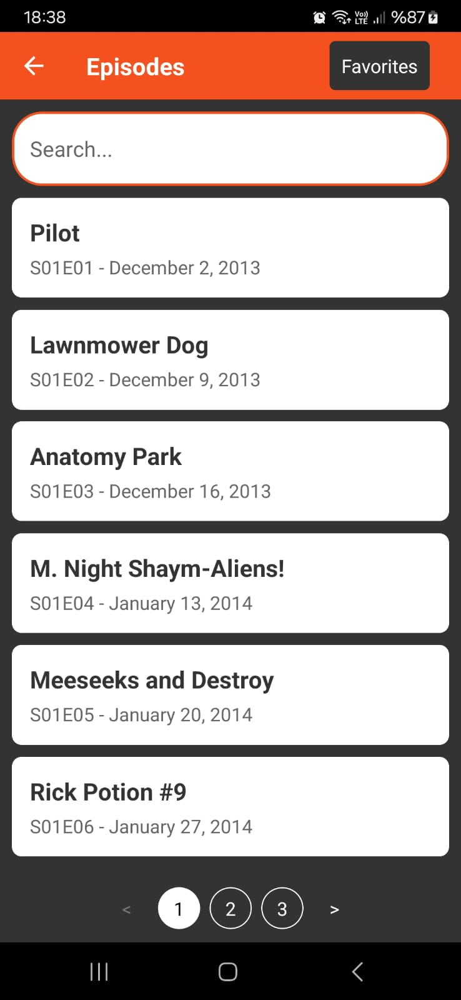 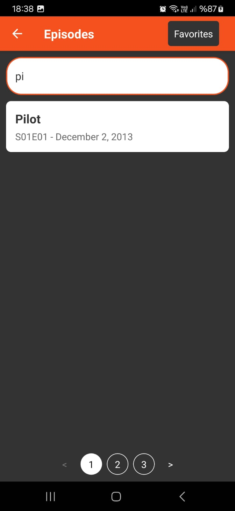
#### Genel Bakış
Bölüm Listesi ekranı, Rick and Morty serisinin tüm bölümlerinin listelendiği ve arama yapılabildiği interaktif bir arayüz sunar. Kullanıcılar bu ekrandan her bölümün detaylarını inceleyebilir ve diledikleri bölümleri arayarak hızlıca bulabilirler.

#### Özellikler
- **Arama Çubuğu:** Kullanıcılar, serinin bölümleri içinde isim veya diğer özelliklere göre arama yapabilirler. Arama işlevselliği API tabanlıdır; bu, arama sorgularının sunucu tarafında işlenip sonuçların uygulamaya geri döndürüldüğü anlamına gelir.
- **Bölüm Listesi:** Her bölümün adı, sezon ve bölüm numarası ile yayın tarihi, kullanıcıya net bir biçimde sunulur.
- **Sayfalama Kontrolleri:** Kullanıcılar, listelenen bölümler arasında sayfalama yapabilirler. Bu, özellikle uzun listelerde, kullanıcının istediği bölüme kolayca erişebilmesi için yararlıdır.

#### Tasarım
- Ekranın üst kısmında yer alan arama çubuğu, yuvarlatılmış köşelere ve geniş bir etkileşim alanına sahip olup, kolay erişim için merkezi bir konumdadır.
- Bölüm listesi, her bir öğenin okunabilirliğini artırmak için geniş bir beyaz alana yerleştirilmiştir.
- Sayfalama kontrolleri, ekrana uyum sağlayacak şekilde alt kısmında yer alır ve sezgisel bir "<" ve ">" işaretiyle donatılmıştır.
- Üst sağ köşede yer alan "Favorites" butonu, kullanıcılara hızlıca Favori Karakterler ekranına geçiş yapma imkânı sunar.

#### Kullanıcı Etkileşimi
- Kullanıcılar, arama çubuğuna tıklayarak klavyeyi açabilir ve istedikleri terimleri yazmaya başlayabilirler.
- Bir bölümün üzerine tıklamak, kullanıcıyı o bölümün detaylarına götüren ekrana yönlendirir.
- Sayfalama kontrolleri, kullanıcının listelenen bölümler arasında sayfa sayfa gezinmesine olanak tanır.

#### Teknik Detaylar
- Listeleme ve sayfalama işlemleri, performansı artırmak ve akıcı bir kullanıcı deneyimi sunmak için verimli bir şekilde kodlanmıştır.
- Her bir bölüm, dokunulabilir `TouchableOpacity` bileşeni kullanılarak interaktif hale getirilmiştir ve kullanıcı etkileşimine hızlı yanıt verir.

---

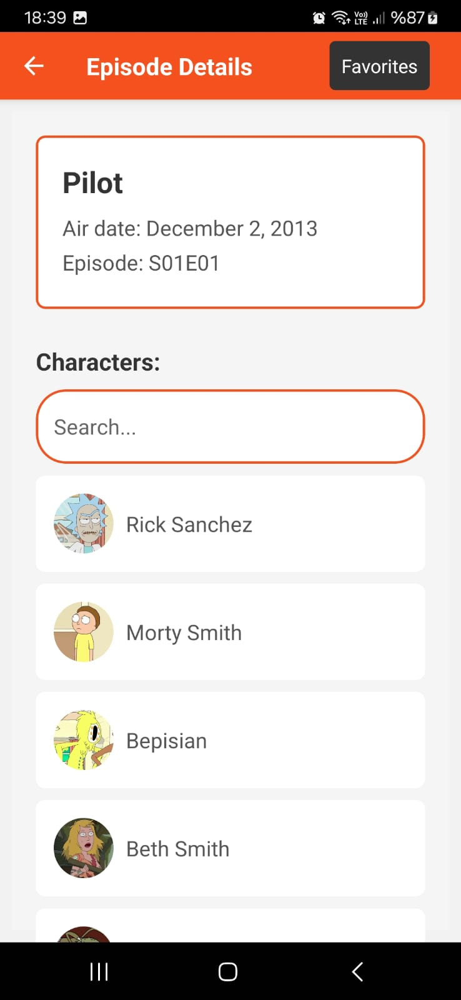 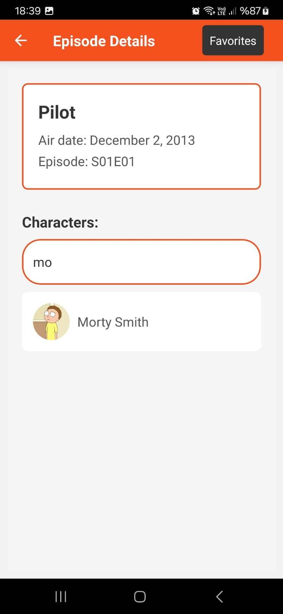
#### Genel Bakış
Bölüm Detayları ekranı, seçilen bölümün ayrıntılı bilgilerini ve bölümde yer alan karakterleri gösterir. Kullanıcılar, bölüm hakkındaki temel bilgilere erişebilir ve bölümde görünen karakterlerin listesini inceleyebilirler.

#### Özellikler
- **Bölüm Bilgileri:** Bölümün adı, yayın tarihi ve sezon/bölüm numarası büyük ve okunaklı harflerle gösterilir.
- **Karakter Listesi:** Bölümde yer alan karakterlerin görselleri, isimleri ve küçük resimleri listelenir, kullanıcıların her bir karakter hakkında hızlıca görsel bilgi sahibi olmasını sağlar.
- **Arama Çubuğu:** Kullanıcılar, ekrandaki arama çubuğunu kullanarak listelenen karakterler içinde arama yapabilirler.

#### Tasarım
- Ekranın üst kısmı, bölümün başlığını ve yayın tarihini içeren bir bilgi kartı şeklindedir. Bu kart, bilgileri net ve anlaşılır bir biçimde sergiler.
- Karakter listesi, her bir karakter için yuvarlak köşeli, beyaz arka planlı kartlarda sunulur.
- Arama çubuğu, karakter listesinin üst kısmında yer alır ve yuvarlatılmış köşelere sahip olarak tasarlanmıştır.

#### Kullanıcı Etkileşimi
- Kullanıcılar, arama çubuğuna tıklayarak diledikleri karakteri arayabilirler.
- Her karakter kartına tıklandığında, kullanıcı ilgili karakterin detaylarına götürülecek şekilde yönlendirilir.

#### Teknik Detaylar
- Karakter listesi, performansı artırmak ve kullanıcı deneyimini zenginleştirmek için `FlatList` bileşeni kullanılarak render edilmiştir.
- Arama işlevselliği, kullanıcının giriş yaptığı terime göre karakterleri filtrelemek için bir API isteği yapar. Kullanıcı yazmayı bitirdiğinde arama gerçekleştirilir, böylece gereksiz isteklerden kaçınılır.
- Ekranın sağ üst köşesindeki "Favorites" butonu, kullanıcıların favori karakterlerinin listesine kolayca erişebilmesi için sabit bir konumda bulunur.

---


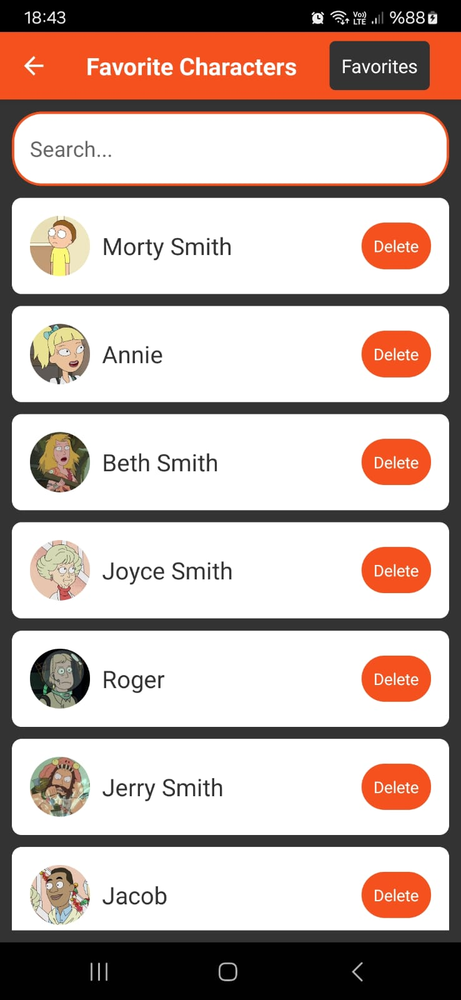 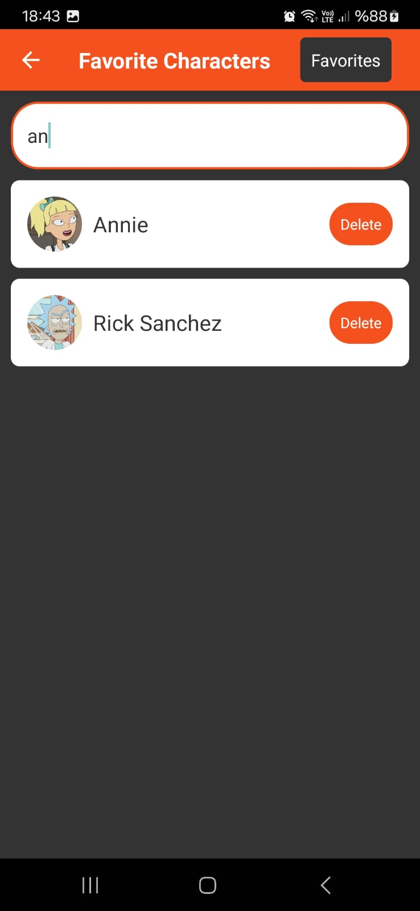
#### Genel Bakış
Bölüm Detayları ekranı, seçilen bölümün ayrıntılı bilgilerini ve bölümde yer alan karakterleri gösterir. Kullanıcılar, bölüm hakkındaki temel bilgilere erişebilir ve bölümde görünen karakterlerin listesini inceleyebilirler.

#### Özellikler
- **Bölüm Bilgileri:** Bölümün adı, yayın tarihi ve sezon/bölüm numarası büyük ve okunaklı harflerle gösterilir.
- **Karakter Listesi:** Bölümde yer alan karakterlerin görselleri, isimleri ve küçük resimleri listelenir, kullanıcıların her bir karakter hakkında hızlıca görsel bilgi sahibi olmasını sağlar.
- **Arama Çubuğu:** Kullanıcılar, ekrandaki arama çubuğunu kullanarak listelenen karakterler içinde arama yapabilirler.

#### Tasarım
- Ekranın üst kısmı, bölümün başlığını ve yayın tarihini içeren bir bilgi kartı şeklindedir. Bu kart, bilgileri net ve anlaşılır bir biçimde sergiler.
- Karakter listesi, her bir karakter için yuvarlak köşeli, beyaz arka planlı kartlarda sunulur.
- Arama çubuğu, karakter listesinin üst kısmında yer alır ve yuvarlatılmış köşelere sahip olarak tasarlanmıştır.
- **Silme İşlemi:** Her karakterin yanında bir "Delete" butonu bulunur ve kullanıcılar bu buton aracılığıyla karakteri favoriler listesinden çıkarabilirler.

#### Kullanıcı Etkileşimi
- Kullanıcılar, arama çubuğuna tıklayarak diledikleri karakteri arayabilirler.
- Karakterlerin üzerindeki "Delete" butonuna tıklamak, bir onaylama iletişim kutusunu tetikler. Bu iletişim kutusu, kullanıcıdan karakteri favoriler listesinden çıkarma eylemini onaylamasını ister.
- Her karakter kartına tıklandığında, kullanıcı ilgili karakterin detaylarına götürülecek şekilde yönlendirilir.

#### Teknik Detaylar
- Karakter listesi, performansı artırmak ve kullanıcı deneyimini zenginleştirmek için `FlatList` bileşeni kullanılarak render edilmiştir.
- Arama işlevselliği, kullanıcının giriş yaptığı terime göre karakterleri filtrelemek için bir API isteği yapar. Kullanıcı yazmayı bitirdiğinde arama gerçekleştirilir, böylece gereksiz isteklerden kaçınılır.
- Ekranın sağ üst köşesindeki "Favorites" butonu, kullanıcıların favori karakterlerinin listesine kolayca erişebilmesi için sabit bir konumda bulunur.
- Silme işlemi, bir karakteri favorilerden çıkarmak için bir onay gerektirir. Bu, kullanıcı yanlışlıkları önlemek için önemlidir.
- Arama işlevselliği, kullanıcı arama terimini girer girmez çalışacak şekilde optimizasyon yapılmıştır.
- Uygulama, karakteri favoriler listesinden çıkarmak için bir `Alert` bileşeni kullanır, bu da kullanıcıya yanlışlıkla silme işlemi yapmalarını önlemek için bir fırsat sunar.

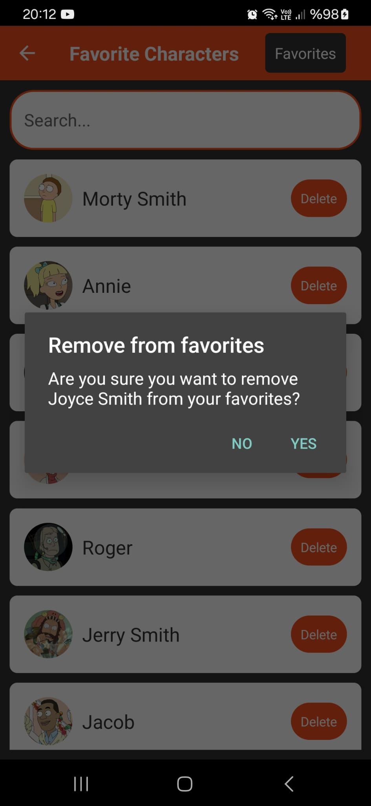


---

Bu doküman parçası, yüklenen ekran görüntüsüne dayanarak hazırlanmıştır ve `FavoriteCharactersScreen`'in işlevselliğini, tasarımını ve kullanıcı etkileşimlerini ayrıntılı olarak açıklar.


---


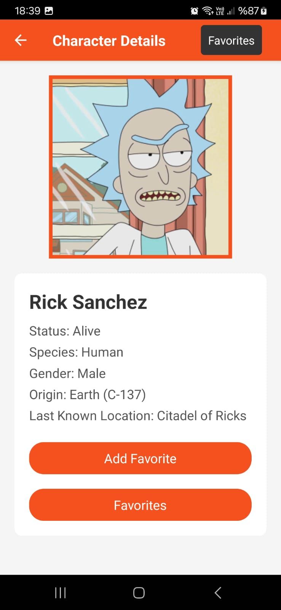

#### Genel Bakış
Karakter Detayları ekranı, kullanıcıların Rick and Morty serisinden bir karakter hakkında detaylı bilgi edinebileceği bir arayüzdür. Bu ekran, karakterin resmi, adı, durumu, türü, cinsiyeti, kökeni ve son bilinen konumu gibi önemli bilgileri içerir.

#### Özellikler
- **Karakter Görseli:** Karakterin büyük bir resmi ekranın üst kısmında yer alır ve karakteri tanımlayan ana görsel öğedir.
- **Karakter Bilgileri:** Karakter hakkındaki detaylar net ve okunaklı bir biçimde listelenir.
- **Favorilere Ekleme Butonu:** Kullanıcılar, ekranda yer alan "Add Favorite" butonuna tıklayarak karakteri favori listelerine ekleyebilirler.
- **Favorilere Gitme Butonu:** Kullanıcılar, ekranda yer alan "Favorites" butonuna tıklayarak favori karakterlerinin listelendiği ekrana geçiş yapabilirler.

#### Tasarım
- Ekran, karakterin resmini ve bilgilerini ön plana çıkaracak şekilde düzenlenmiştir. Böylece kullanıcılar karakter hakkında hızlı ve etkili bir biçimde bilgi edinebilirler.
- Butonlar, kullanıcının dikkatini çekmek ve interaktifliği artırmak için canlı turuncu renkte tasarlanmıştır.

#### Kullanıcı Etkileşimi
- "Add Favorite" butonuna tıklandığında, karakter, uygulamanın favori listesine eklenir. Bu işlem sırasında, karakterin zaten favori listesinde olup olmadığı kontrol edilir ve eğer maksimum favori sayısına ulaşılmışsa bir uyarı mesajı gösterilir.
- "Favorites" butonu, kullanıcıyı doğrudan favori karakterlerinin listelendiği ekrana yönlendirir.

#### Teknik Detaylar
- Favorilere ekleme işlemi, Redux state yönetimi ve AsyncStorage kullanılarak kalıcı hale getirilir.
- "Add Favorite" ve "Favorites" butonları, dokunulabilir `TouchableOpacity` bileşeni kullanılarak oluşturulur, böylece dokunma eylemine hızlı yanıt verilebilir ve basit bir animasyon sağlanır.
- ASYNSCStorage, kullanıcıların favori karakterlerini cihazda saklamak için kullanılır ve bu sayede kullanıcılar uygulamayı kapatsalar bile favori karakterlerini kaybetmezler.


---

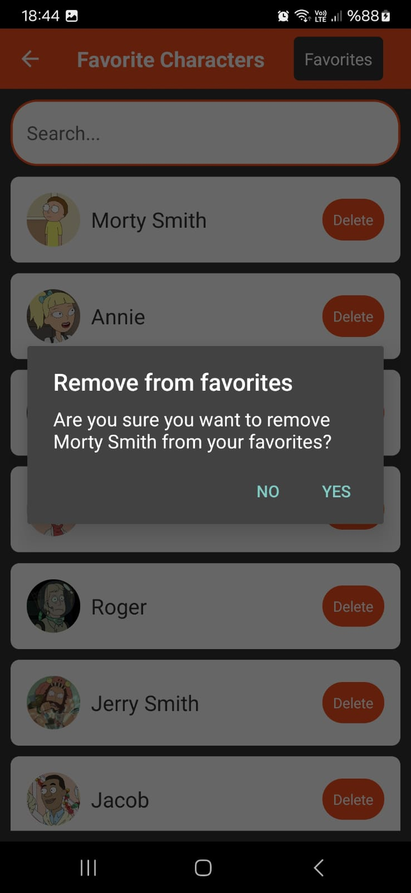 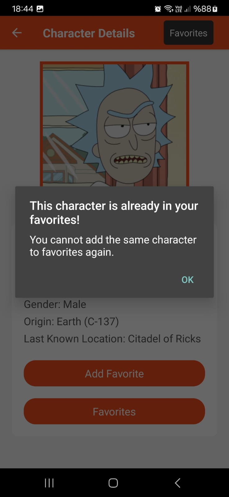

#### Genel Bakış
Uygulamanın "Karakter Detayları" ekranı, kullanıcılara karakterler hakkında detaylı bilgi sunar ve favorilere ekleme işlevi sağlar. Bu işlev, kullanıcılara karakteri favori listelerine eklemelerine olanak tanır. Ancak, bu işlevle ilgili iki önemli kısıtlama vardır:

1. Bir karakter yalnızca bir kez favorilere eklenebilir.
2. Favori listesine en fazla 10 karakter eklenebilir.

#### İşlevsellik
- **Tekrar Ekleme Engelleme:** Kullanıcılar, zaten favori listesinde olan bir karakteri tekrar eklemeye çalıştıklarında, bir uyarı mesajı alırlar. Bu, karakterin tekrar eklenemeyeceğini ve zaten favorilerde olduğunu belirtir.
- **Maksimum Sınır Kontrolü:** Favori listesinde yer alan karakter sayısı 10'a ulaştığında, kullanıcılar başka bir karakter eklemeye çalıştıklarında, maksimum sınırı aştıklarını belirten bir uyarı mesajı görürler. Bu durumda, yeni bir karakter ekleyebilmek için mevcut favorilerden bir veya daha fazla karakterin çıkarılması gerekmektedir.

#### Uyarı Mesajları
- Eğer kullanıcı zaten favorilerde olan bir karakteri tekrar eklemeye çalışırsa, şu mesaj gösterilir: "Bu karakter zaten favorilerinizde! Aynı karakteri tekrar favorilere ekleyemezsiniz."
- Eğer kullanıcı favori listesine 10'dan fazla karakter eklemeye çalışırsa, şu mesaj gösterilir: "En fazla 10 karakter favori listenizde bulunabilir! Daha fazla karakter eklemek için, mevcut favorilerinizden birini çıkarmanız gerekir."

#### Tasarım ve Kullanıcı Etkileşimi
- Uyarı mesajları, kullanıcı dostu bir diyalog kutusu içinde, uygulamanın genel tasarımına uygun renk ve tipografide sunulur.
- "OK" butonu, diyalog kutusunu kapatmak ve kullanıcıya normal ekran görünümüne geri dönme seçeneği sunar.

#### Teknik Detaylar
- Favori işlevi, Redux state yönetimi ve AsyncStorage kullanılarak gerçekleştirilir.
- Karakter zaten favorilerde ise veya favori sayısı maksimuma ulaşmışsa, ilgili durumlar Redux state'inde kontrol edilir ve uygun uyarı mesajları `Alert` bileşeni aracılığıyla gösterilir.

---


